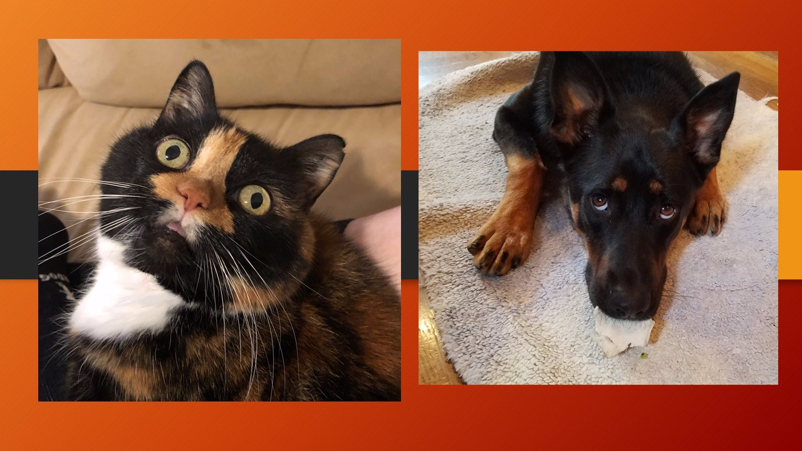

# Pet-Happiness

# Introduction

Until one has loved an animal a part of one's soul remains unawakened....*Anatole France*

Since ages pets are believed to play a significant role in one's life.There are many studies which show that regular interaction with the pets may increase one's life span and happiness. 

Studies show that pet ownership reduces stress, lowers blood pressure, helps to prevent heart disease, helps to fight depression, and therefore lowers one's healthcare costs (APPMA.org)

* Are pets really associated with one's happiness?
* Do they really play an important role in owner's
  physical happiness.
* Is pet ownership really associated with the
  nation's and owners financial status.

Some of these questions made us work on this topic.

*Source of Information*

The main source of information 

* www.kaggle.com
* data.worldbank.org
* www.theatlas.com

Happiness data pulled from 
* https://www.kaggle.com/unsdsn/world-happiness/home

pet population data pulled
*  https://www.petsecure.com.au/pet-care/a-guide-to-worldwide-pet-ownership/

# Analysis 

For the analysis part first the correaltions were drafted according to the available data. The cleaning of data was done and made into CSV files.

Top 20 DOG and CAT population by country:

*Rest all graphs can be accessed on website*

The analysis was divided into three parts.
* Pet to Human Ratios and National Happiness.
* Correlation of pet ownership with life expectancy
  and happiness score.
* Correlation of pet ownership with the GDP of 
  country.

***Pet to human ratios and National Happiness***

The data was constructed by merging top 20 countries by pet ownership (dog, cat, bird and fish) and World Bank data on *population* and *national happpiness*. The expected general appearance of the national happiness compared to pet:human ratios was positive. In general, higher pet density did appear to be correlated with a greater national happiness score.  

Due to limited data, it is almost impossible to determine the true impact that pet ownership has on national happiness.  The correlation between pet ownership rates and national happiness appears to be strongest among dogs followed by cats, birds and finally, fish. The analysis can be seen clearly in the graphs/visualisations below.

*Rest all graphs can be accessed on website*

***Correlation of pet ownership with life expectancy
 and happiness score***

As stated above , it was found that there is a strong correlations between pet Ownership , Life Expectancy and Happiness Score.
While many medical experts focus on lifesaving drugs,they often fail to suggest that their patients adopt a pet.  Noticeable correllation was observed when comparing pet populations to life expectancy.   Coincidence?  We think not.  

***Correlation of pet ownership with the GDP of 
  country.***

Pets to GDP is another under studied topic that many economists have neglected over the past centuries.  Surprisingly, there was little visible correlation between GDP of a country and total numbers of pets owned by country. The analysis was done by merging the data of pet population with the country GDP(2017).

The analysis clearly shows that USA is the country having highest GDP having the highest *DOG*,*CAT*,*FISH* pet population which may be because the more the country and its people are financially strong they can take care of pet.

*Rest all graphs can be accessed on website*

#Limitations of the studies:

* The accesibility of the data was a big limitation ,  due to which we have to limit our data for top 20
  countries and the four types of pets.
* The time frame was another limit. 

# Further scope 

Like every study has its own limits which gives further scope of research and analysis.Our study has following scope:

* Addition of more pets.
* Corelation of mental illness with the pet owners
  and non-owners.
* correlation of pet ownership with urban Vs rural
  population.
* corelation of pet-ownership with the family people
  (single)

# HEROKU 

https://pet-happiness.herokuapp.com/pet_per_capita

Due to limited available data, a feature was created to collect the pet information which will allow users to input their pet's location, species and name. The data collected on the website is then put into a postgresql database and plotted on a map.  

